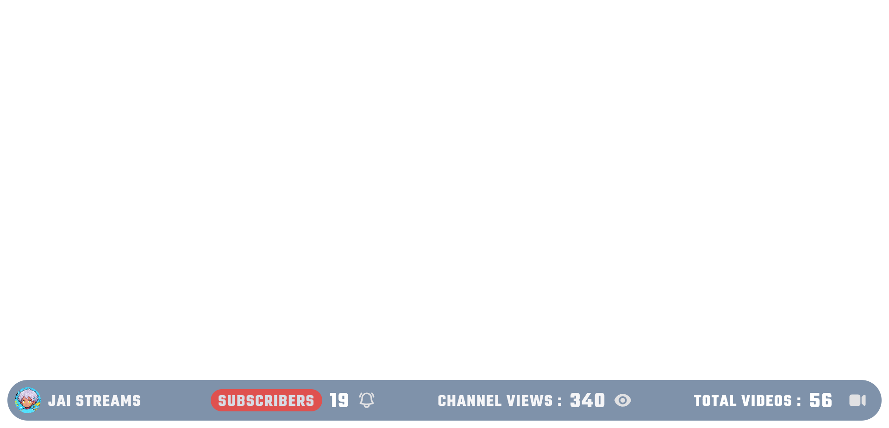

# youtube_stats
for obs overlay using browser source


# add apikey 
create .env file 
```
YOUTUBE_API_KEY=your api key here.
CHANNEL_ID=your channel id.
PORT=3000
```

# run 
```
npm install

node server.js
```

# open in browser
http://localhost:3000
